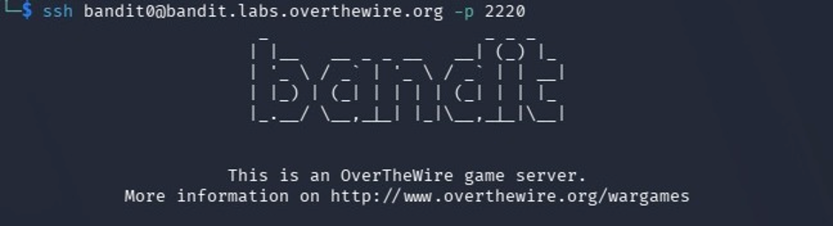

# Over the Wire Bandit Write Up
****


## Introduction

This article is a write-up of the [overthewire bandit wargame](https://overthewire.org/wargames/bandit/). The bandit wargame is a series in the war games on the [Overthewire](https://overthewire.org/wargames/) website that helps one learn Linux from begginers level to expertise. It contains a series of levels, each one a Linux server you log into where you find the password for the next level. 

The Bandit wargame game is free and does not need any subscription fee or payment of any form. You can support the site by [donating](https://overthewire.org/information/donate.html) and here are the [rules to consider while playing the game](https://overthewire.org/rules/).

I have eradicated the passwords for the next levels where necessary using this format (***********************)

## Categories
- [SSH login & file basics (0–5)](#level-0)
- [Searching and filtering (6–10)](#level-6)
- [Encoding and transformations (11–13)](#level-11)
- [Networking basics (14–17)](#level-14)
- [SSH and restricted shells (18–20)](#level-18)
- [Automation and cron jobs (21–24)](#level-21)
- [Restricted shell escapes (25–26)](#level-25)
- [Git and source control (27–34)](#level-27)


## Level 0

Link to this level: [https://overthewire.org/wargames/bandit/bandit0.html](https://overthewire.org/wargames/bandit/bandit0.html)

To solve level 0, you need to log into bandit0 with the password **bandit0** using SSH on bandit.labels.overthewrite.org and port 2220.

Connect with ssh by using the following command:

```markdown
ssh bandit0@bandit.labs.overthewire.org -p 222

```
Once it is connected you will see the below output




### Common mistakes
I used bandit.labs.overthewire.org while logging in instead of bandit0@bandit.labs.overthewire.org.


>Notice we used bandit0@bandit.labs.overthewire.org and not bandit.labs.overthewire.org while logging in using ssh, this is because we are on level 0 and this pattern will continue throughout the levels except for the ones where you are expected to use ssh keys (Do not stress about this, more on this to come). We will attach bandit with the level number and place it before the host bandit.labs.overthewire.org in order to be able to login at each level.

Whenever you find a password for a level, save it in a separate file and use SSH (on port 2220) to log into the next level to continue the game.

> Ps: The port number does not change

###	Command breakdown
<ul>
<li>ssh – This is a protocol used to securely connect to another computer over a network.</li>
</ul>


## Level 1

Link to this level: [https://overthewire.org/wargames/bandit/bandit1.html](https://overthewire.org/wargames/bandit/bandit1.html)

For this level, you need to find the password located in the readme file in the home directory.


Log into this level by using the below command

```markdown
ssh bandit0@bandit.labs.overthewire.org -p 2220

```
The password is the same as level 0: **bandit0**

List out the contents of the file using ls.

`ls`

There is a readme file in it, read out it’s content using cat to find the password.

`Cat`

It will print the following

````python
Congratulations on your first steps into the bandit game!!
Please make sure you have read the rules at https://overthewire.org/rules/
If you are following a course, workshop, walkthrough or other educational activity,
please inform the instructor about the rules as well and encourage them to
contribute to the OverTheWire community so we can keep these games free!

The password you are looking for is: ************
````

### Alternative solutions


| Command | Alternatives  |
| -------- | :------: |
| ls     | dir, find    |
| cat     | less     |


###	Command breakdowns
<ul>
<li>ls stands for list and it is used to display the contents of directories.</li>
<li>Cat stands for concatenate and it displays the contents of a file.</li>
</ul>

## Level 2

Link: [https://overthewire.org/wargames/bandit/bandit2.html](https://overthewire.org/wargames/bandit/bandit2.html)

Log into this level using the below command

```markdown
ssh bandit1@bandit.labs.overthewire.org -p 2220

```
Use the password from the previous level here; the one located in the readme file in level1.

List out the content of the directory using ls

`ls`

###	Common mistakes
I forgot to log out of the previous machine, level0, before logging into level1.

> Use the logout commands to get out of the previous level first before logging into level 1.
> 
> `Logout`


The command cat does not work here. It assumes you are passing something over the standard input. You can read about cat using the commands man cat to see how it interprets a - and press q to exit once done.

`Man cat`

 Hence, when you prepend it with a ./. it will print out the next password

`cat ./-`


## Level 3

Link: [https://overthewire.org/wargames/bandit/bandit3.html](https://overthewire.org/wargames/bandit/bandit3.html)

Log into this level using this command


```markdown
ssh bandit2@bandit.labs.overthewire.org -p 2220

```
The password is the one you found on level 2.

List out the contents of this directlory using ls

`ls` 

Using the same commands as level 2 will not work here and neither will the command cat.

The secret here is to stop option parsing and quote/escape the filename. This can be done using the below command:

```markdown
cat -- "--spaces in this filename--"

```

###	 Alternative solutions

| Command | Alternatives  |
| -------- | :------: |
| cat     | less, head     |
 

###	Command breakdowns
<ul>
<li>--  this tells the terminal “end of options” - that no more command-line options follow</li>
<li>The quotes “” treat the name as a file name instead of different files names because of the spaces in them.</li>
</ul>


## Level 4

Link: [https://overthewire.org/wargames/bandit/bandit4.html](https://overthewire.org/wargames/bandit/bandit4.html)


Log into this level using this command and the password from the previous level

```markdown
ssh bandit3@bandit.labs.overthewire.org -p 2220

```
List the content of the directory using ls

`ls`

Enter the inhere directory using the below command

`cd`

When you list the content of the inhere directory using ls, nothing gets displayed. Hence I used ls -a to list all the files in it including the hidden ones

```markdown
Ls -a
```

You will find a hidden file called ...Hiding-From-You. Read the content of the hidden file using the same logic as in the previous level.

###	Command breakdowns
<ul>
<li>ls -a – is used to list all the contens of a directory including the hidden files as is in this case.</li>
</ul>


## Level 5
Link: [https://overthewire.org/wargames/bandit/bandit5.html](https://overthewire.org/wargames/bandit/bandit5.html)

Log into this level using these commands and the password from the previous level

```markdown
ssh bandit4@bandit.labs.overthewire.org -p 2220

```

listing the contents of the inhere file, you will find the below list:

> -file00  -file01  -file02  -file03  -file04  -file05  -file06  -file07  -file08  -file09

We need to see the content of all these files and the one that will be human-readable will be our password. Remember, they all start with a dash hence do not forget to parse the argument.

I tried the easy, but time-consuming way, which is to do this by printing the content of each file individually using cat./<filename>

`Cat ./<filename>`

However, the best way would be to read the content of all these files all at once and see which one contains a human-readable password. You can use the * to signify all by using this command:

```markdown
cat -- ./-file*
```

For me, file -file07contained the password.


## Level 6

Link: [https://overthewire.org/wargames/bandit/bandit6.html](https://overthewire.org/wargames/bandit/bandit6.html)


Log into this level using these commands and the password from the previous level

```markdown
ssh bandit5@bandit.labs.overthewire.org -p 2220

```

Inside the inhere directory, there are various directories with files inside them and the goal is to find a file that has all the  properties listed in the query. 

We can do this by using the find command and specifying the properties. Using the same logic as in level 5, search all the directories using the * to signify all.

I first tried using different commands, each checking for a specific property, then picking the one that meets all of them, such as:

> . – signifies in the current directory
> 

```markdown
find maybehere* . -size 1033c
```
```markdown
find maybehere* . ! -executable
```
```markdown
find maybehere* . -type f
```

However, combining the command into one is much easier and faster

```markdown
find maybehere* . -type f  -size 1033c ! -executable

```

Mine is located in ./maybehere07/.file2

You can then cd into that directory and read the contents of file2

### Command breakdowns
<ul>
<li>size 1033c – checks the files size</li>
<li>! -executable – checks if the file is not executable</li>
<li>type f – checks if the file is regular or human-readable.</li>
</ul>


## Level 7

Link: [https://overthewire.org/wargames/bandit/bandit7.html](https://overthewire.org/wargames/bandit/bandit7.html)


Log into this level using this commands and the password from the previous level

```markdown
ssh bandit6@bandit.labs.overthewire.org -p 2220

```

We are searching in the root directory blindly for a storage with the mentioned properties, after logging in, we can use a combination of commands that checks for all the  properties such as:

```markdown
find / -user bandit7 -group bandit6 -size 33c
```

But this gives a long list of files and directories which cannot be scanned quickly by the human eye.

We can redirect all errors into the null file using the 2>/dev/null in order to eliminate all the results that say “permission denied”

```markdown
find / -user bandit7 -group bandit6 -size 33c 2>/dev/null

```
Hence the password is found in 

> /var/lib/dpkg/info/bandit7.password

You can navigate to the specific file and read the password.

### Common mistakes
I assumed the mentioned storage was a file and failed to redirect the errors to the null file making my results so large and unreadable.

###	Command breakdowns
<ul>
<li>/ - refers to the root directory</li>
<li>user bandit7 – checks to see if it is owned by bandit7</li>
<li>group bandit6  - checks to see if it is belongs to the group bandit6</li>
<li>size 33c – checks for the size</li>
<li>2>/dev/null – redirects the errors to the null file for a cleaner output</li>
</ul>


## Level 8

Link: [https://overthewire.org/wargames/bandit/bandit8.html](https://overthewire.org/wargames/bandit/bandit8.html)


Log into this level using this commands and the password from the previous level

```markdown
ssh bandit7@bandit.labs.overthewire.org -p 2220

```

We need to read the content of the data.txt file and extract the password, but when you run the cat command, the contents of the file is too large.

Hence we need to use grep and specify out search to find the specific word next to millionth.

```markdown
cat data.txt | grep "millionth"

```

## Level 9

Link: [https://overthewire.org/wargames/bandit/bandit9.html](https://overthewire.org/wargames/bandit/bandit9.html)


Log into this level using this commands and the password from the previous level

```markdown
ssh bandit8@bandit.labs.overthewire.org -p 2220

```
For this challenge, we will have to sort the content of data.txt first before finding out the line that occurs only once using the below command.

```markdown
sort data.txt | uniq -u

```
###	Common mistakes
Using the cat and uniq command, issue is the uniq command does not scan the whole file, only adjacent lines, hence this will not give the correct results.

### Commands breakdown
<ul>
<li>Uniq -u – only prints single occurrences.</li>
</ul>

> Ps: Uniq only works after sorting because it only compares adjacent lines hence the need to start with sorting first.

## Level 10

Link: [https://overthewire.org/wargames/bandit/bandit10.html](https://overthewire.org/wargames/bandit/bandit10.html)


Log into this level using this commands and the password from the previous level

```markdown
ssh bandit9@bandit.labs.overthewire.org -p 2220

```
For this challenge, we need to search for strings inside the data.txt file and make sure it starts with an equal sign, =. 

Using grep, you can specify the starting part of a search and combine it with the string command.

```markdown
strings data.txt | grep "^="

```

###	Command breakdown
<ul><li>String – it prints the human-readable part of the file.</li></ul>


## Level 11

Link: [https://overthewire.org/wargames/bandit/bandit11.html](https://overthewire.org/wargames/bandit/bandit11.html)


Log into this level using these commands and the password from the previous level

```markdown
ssh bandit10@bandit.labs.overthewire.org -p 2220

```
We are going to decode the content of data.txt using the base64 command along with the –decode command.

```markdown
Base64 --decode data.text

```

###	Command breakdowns
<ul>
<li>base64 – it is used to encode and decode base64 file content.</li>
<li>--decode – it reverses the encoding process</li>
</ul>

## Level 12

Link: [https://overthewire.org/wargames/bandit/bandit12.html](https://overthewire.org/wargames/bandit/bandit12.html)


Log into this level using this command and the password from the previous level

```markdown
ssh bandit11@bandit.labs.overthewire.org -p 2220

```

The data in the file has been ceaser-shifted using ROT13 and we need to reverse it so that we can find the password. 

We can read then file the transform them 13 positions using the tr command such as:

```markdown
cat data.txt | tr 'A-Za-z' 'N-ZA-Mn-za-m'

```

###	Command breakdowns
<ul>
<li>tr – transforms the read data in the specified commands.</li>
</ul>


You can read more about this on [ROT13 Wikipedia page](https://en.wikipedia.org/wiki/ROT13 )


## Level 13

Link: [https://overthewire.org/wargames/bandit/bandit12.html](https://overthewire.org/wargames/bandit/bandit12.html)


Log into this level using this command and the password from the previous level

```markdown
ssh bandit12@bandit.labs.overthewire.org -p 2220

```
We  first need to create a temporary directory and copy the content of data.txt into it so that we can work from there.

 Using the file type command, we are going to decode the file until it gives us ascii data type and that will be our password.


Create a temporary directory:

`mktemp -d
`

move into the temp directory using 

`cd`

copy the data.txt into it using 

`cp ~/data.txt .`

We have been told the format of the file is a hexdump, hence we decompress and save it in a new file called workingdata is using:

```markdown
xxd -r data.txt > workingdata

```
then we check the type of working data using the command

`file workingdata
`

It is a gzip compressed file, we will first rename the file to a .gzip file so that we can be able to decopress it using:

```markdown
mv workingdata  workingdata.gz

```
> The command mv renames the file
> 

we then decompress it using the gunzip commands

```markdown
gunzip workingdata.gz

```
We then check the type of the new file created using the file commands, it is a bzip2 file.

We will convert it using the same process and below is a list of commands to use for different data types until you find the answer:

| Data Type | Extension | Command |
| -------- | -------- | -------- |
| Hexadecimal   | hex  | xxd -r  |
| Gzip   | gz   | gunzip   |
| Bzip2  | bz2   | bunzip2  |
| Posix   | tar   | tar -xf   |


###	Common mistakes
Using the wrong format to decode the different file types.

Forgetting to direct the copied data.txt file into the right temporary made directory.

Not renaming the files to have the right file type extension before decoding them.

> Adding a fullstop at the end of the file name tells the terminal to copy the file in the directory you are currently at.


## Level 14
Link: [https://overthewire.org/wargames/bandit/bandit14.html](https://overthewire.org/wargames/bandit/bandit14.html)


Log into this level using this commands and the password from the previous level

```markdown
ssh bandit13@bandit.labs.overthewire.org -p 2220

```

In this level, all you need to do is extract the content of the sshkey.private and store it in your local machine in a new file

You can start by listing the available files using the list command and then reading the content of the sshkey.private file using the cat command. 

The easiest way is to copy and paste the contents into a new file on your local machine using the nano command then saving it. 

Exit the bandit workspace and save the file in your machine locally. Your new file must have the .key extension.

```python
Ls 
Cat sshkey.private
nano lvl4.key
```

## Level 15

Link: [https://overthewire.org/wargames/bandit/bandit15.html](https://overthewire.org/wargames/bandit/bandit15.html)


To access this level you are going to use the private key you stored in your local machine in the  previous level.

Fist you need to change the mode of the file, mine is called lvl14.key, using the command chmod 600 command and then logging in using the same format but appending the key at the end to be used as the password.

```markdown
chmod 600 lvl4.key

```
```markdown
ssh bandit14@bandit.labs.overthewire.org -p 2220 -i lvl14.key

```
The password for each file are stored in the /etc/bandit_pass directory and it can only be accessed by the user in that directory, i.e, bandit14 can only be accessed while logged in at level 14.

```markdown
cd /etc/bandit_pass

```
Reading the content of the file at /etc/bandit_pass/bandit14, you will be able to access the password that was being referred in level 14 becuase now you are logged in as user14.


After reading the  password, use the commands nc to pass it to port 30000 on localhost.

```markdown
echo "xxx – your password here - xxx" | nc localhost 30000

```

## Level 16
Link: [https://overthewire.org/wargames/bandit/bandit16.html](https://overthewire.org/wargames/bandit/bandit16.html)


You are going to log into this level by using the same private ssh key you stored in your local machine and then using the password you retrieved in level 15 to login.

 Use the below command 

```markdown
ssh bandit15@bandit.labs.overthewire.org -p 2220 -i lvl14.key

```
You can read the password for this level in /etc/bandit_pass/bandit15 using the cat command and then submitting it to port 30001 on localhost. 

The difference between this level and level 15 is that you are connecting using TLS encryption here. 

Here is the commands for this level

```markdown
echo "XXXXXXXXXXXXXXXXXXXXXXXXXXXXXXXX" |  openssl s_client -quiet -connect localhost:30001
```

###	Command breakdowns
<ul>
<li>S_client - Starts OpenSSL in SSL/TLS client mode, allowing you to connect to a TLS-enabled server</li>
<li>Quiet - Suppresses most of OpenSSL's diagnostic output (certificate details, handshake information, etc.), leaving mostly the application data. This makes it easier to interact with the server.</li>
</ul>


## Level 17

Link: [https://overthewire.org/wargames/bandit/bandit17.html](https://overthewire.org/wargames/bandit/bandit17.html)


You will log in using the same ssh private key and password from the previous level using the below command.

```markdown
ssh bandit16@bandit.labs.overthewire.org -p 2220 -i lvl14.key

```

You can read the password for this level in /etc/bandit_pass/bandit16 using the cat command

```markdown
cat /etc/bandit_pass/bandit16

```

I started by checking which of the ports have servers listening on them using the below Nmap’s command and then checking which one of them speak SSL/TSL and this gave me one successful port which was listening. 

Upon pasting this levels password, I got a private key which I saved in my local machine as lvl17.key .

```markdown
nmap -p31000-32000 localhost

openssl s_client -connect localhost:<port number> (Do this for all port numbers)

echo "<current_password>" | openssl s_client -quiet -connect localhost:<port number> (insert the one that speaks SSL/TLS)
```

## Level 18

Link: [https://overthewire.org/wargames/bandit/bandit18.html](https://overthewire.org/wargames/bandit/bandit18.html)


You will log into this level by using the private key we got from the previous level using the below command:

```markdown
Chmod 600 lvl17.key

ssh bandit17@bandit.labs.overthewire.org -p 2220 -i lvl17.key
```

list the files inside it using ls and you’ll see two files, passwords.new and passwords.old.

Using the below command you should be able to see the difference between  the two passwords and the line marked by a + sign is the next level password.

```markdown
diff -u passwords.old passwords.new

```
## Level 19
Link: [https://overthewire.org/wargames/bandit/bandit19.html](https://overthewire.org/wargames/bandit/bandit19.html)


Since we are logged out using ssh, using the previous format we’ve been using will print: 

> ssh bandit18@bandit.labs.overthewire.org -p 2220 -i lvl17.key
> 
> Byebye !
> 
> Connection to bandit.labs.overthewire.org closed.

Hence, we will log into this level by avoiding to start .bashrc file since it has been modified, by accessing the bin/sh file directly using the below command:

```markdown
ssh -t bandit18@bandit.labs.overthewire.org -p 2220 /bin/sh

```
you can read the contents of the readme file and that is the password of the next level.


###	Command breakdowns
<ul>
<li>-t – starts a pseudo terminal.</li>
</ul>

## Level 20
Link: [https://overthewire.org/wargames/bandit/bandit20.html](https://overthewire.org/wargames/bandit/bandit20.html)


We are going to log into level 19 using the below ssh command and use the password we found in the previous level:

```markdown
ssh bandit19@bandit.labs.overthewire.org -p 2220

```

For this level, we need to be able to access level 20 to be able to read the password at /etc/bandit_pass. 

Listing the content of bandit19, we will see there is a setuid file called bandit20-do in it. 

We will temporarily log in as bandit20-do then access the password at /etc/bandit_pass/bandit20.

```markdown
.bandit20-do whoami

```
This should tell you, you are bandit20. 

Next you are going to read the password of bandit20 using the cat command.

```markdown
./bandit20-do cat /etc/bandit_pass/bandit20

```

## Level 21
Link: [https://overthewire.org/wargames/bandit/bandit21.html](https://overthewire.org/wargames/bandit/bandit21.html)


We are going to log into level 20 using the below ssh command and use the password we found in the previous level:

```markdown
ssh bandit20@bandit.labs.overthewire.org -p 2220

```

Read the password for this level from /etc/bandit_pass/bandit16 using the cat commands and save it.

```markdown
Cat /etc/bandit_pass/bandit21

```

For this level, we are going to connect to a specific port using a setuid binary and send the password we found above, if the password matches this level’s password, it will print back the next levels password.

You are going to open another terminal session and ssh into level 20. 

In one terminal you are going to start a listening server using the below command and send the password for this level.

```markdown
nc -l -p 50000

```
> 50000 is a random unused port number


In the second terminal, you are going to connect to the same port using the below command:

```markdown
./suconnect 50000

```
If the passwords match, the terminal will print out a password for the next level.

> They should match

## Level 22
Link: [https://overthewire.org/wargames/bandit/bandit22.html](https://overthewire.org/wargames/bandit/bandit22.html)

We are going to log into level 19 using the below ssh command and use the password we found in the previous level:

```markdown
ssh bandit21@bandit.labs.overthewire.org -p 2220

```
For this level, we need to find the location of the cron job and read it’s content by following the below steps:

First, we list the content of /etc/cron.d/ then print the configuraton for bandit22

```markdown
ls /etc/cron.d/

cat /etc/cron.d/cronjob_bandit22
```

From the output, we get the location for the user’s cron job at /usr/bin/cronjob_bandit22.sh then read it’s output.

```markdown
cat /usr/bin/cronjob_bandit22.sh

```
From the output, follow the given bash instruction to list out the password in the temporary file

```markdown
chmod 644 /tmp/xxxxxxxxxxxxxxxxxxxxxxxxxxxxxxxxxxxxxxxx
cat /tmp/xxxxxxxxxxxxxxxxxxxxxxxxxxxxxxxxxxxxxxxx
```

###	Common mistakes
I tried to read the content of the temp file while in the /usr/bin/ directory.


## Level 23
Link: [https://overthewire.org/wargames/bandit/bandit23.html](https://overthewire.org/wargames/bandit/bandit23.html)


We are going to log into level 19 using the below ssh command and use the password we found in the previous level:

```markdown
ssh bandit22@bandit.labs.overthewire.org -p 2220

```
This level is almost like the previous level, with the difference being the cron job invokes is a little bit more involved.

List all cron configurations

```markdown
ls /etc/cron.d

```
 Read out the cron configuration for bandit23

```markdown
cat /etc/cron.d/cronjob_bandit23

```
Read out the cron job's script:

```markdown
cat /usr/bin/cronjob_bandit23.sh

```
Read out the file contents

```markdown
Cat /tmp/$mytarget

```

> Where mytarget=$(echo I am user $myname | md5sum | cut -d ' ' -f 1)
> 
> cat /tmp/$(echo I am user bandit23 | md5sum | cut -d ' ' -f 1)


## Level 24

Link:  [https://overthewire.org/wargames/bandit/bandit24.html](https://overthewire.org/wargames/bandit/bandit24.html)


We are going to log into level 19 using the below ssh command and using the password we found in the previous level:

```markdown
ssh bandit23@bandit.labs.overthewire.org -p 2220

```

In this level, you have to trick a cron job into executing your script instead.

We will start by creating a shell script using the cat command and then redirecting the output into a temporary file that we create.

```markdown
cat > /var/spool/bandit24/foo/cat_passwd <<EOF
#!/bin/bash
install --mode=444 /etc/bandit_pass/bandit24 /tmp/bandit_pass_bandit24
EOF
```

We then change the permissions of the file we created and give it 1 minute before we read the output from the bandit_pass_bandit24 file we created earlier

```markdown
chmod +x /var/spool/bandit24/foo/cat_passwd
sleep 60
cat /tmp/bandit_pass_bandit24
```

###	Command breakdowns
<ul>
<li>Install here is used to copy the files and set permissions.</li>
</ul>


## Level 25
Link: [https://overthewire.org/wargames/bandit/bandit25.html](https://overthewire.org/wargames/bandit/bandit25.html)

We are going to log into level 19 using the below ssh command and use the password we found in the previous level:

```markdown
ssh bandit24@bandit.labs.overthewire.org -p 

```

Solve this level by connecting to port 30002 on localhost and giving it the right password. 

The password is a combination of the last level’s password and a random 4 digit pin. 

The seq command is useful for brute-forcing passwords.


```markdown
seq -f "XXXXXXXXXXXXXXXXXXXXXXXXXXXXXXXX %4g" 0 9999 |
    socat STDIO TCP4:localhost:30002 |
    grep -v Wrong!
```


## Level 26
Link: [https://overthewire.org/wargames/bandit/bandit26.html](https://overthewire.org/wargames/bandit/bandit26.html)


We are going to log into level 19 using the below ssh command and use the password we found in the previous level:

```markdown
ssh bandit25@bandit.labs.overthewire.org -p 2220

```
We are going to check for level26 user's entry whose shell has been set to /usr/bin/showtext and then we will inspect the file:

```markdown
grep bandit26 /etc/passwd
cat /usr/bin/showtext
ssh -i bandit26.sshkey -p 2220 bandit26@bandit.labs.overthewire.org
```

We are going to shrink the terminal so that we can be able to only access content that fits the terminal's screen and if the file is longer, it will pause and wait instead of exiting. 

Once paused, we will press v so that it opens the file in vim which runs with bandit26 level privileges hence bypassing the showtext restriction entirely.

Once inside vim, we will make the below edits and save them.

```markdown
:set shell=/bin/bash
:shell
```

We can now read the password for level26 using the cat command:

```markdown
cat /etc/bandit_pass/bandit26

```


> ***The Git level 27 to 31 have almost identical instructions, as you go, brute force your way reading the README file for intruction to figure out where the next password could be hidden and what exactly is expected of you in this git section.***

## Level 27

Link: [https://overthewire.org/wargames/bandit/bandit27.html](https://overthewire.org/wargames/bandit/bandit27.html)


While stil logged in as user bandit26, you are going to read bandit27 password using the below command.

```markdown
./bandit27-do cat /etc/bandit_pass/bandit27

```

## Level 28
Link: [https://overthewire.org/wargames/bandit/bandit28.html](https://overthewire.org/wargames/bandit/bandit28.html)


The goal of this level is to accesss the contents of the git repo given , we are going to clone it in our local machine and use the password from level 28 to access it using the below command:

```markdown
git clone ssh://bandit27-git@bandit.labs.overthewire.org:2220/home/bandit27-git/repo

```
List the content of the files in the repo folder in your local machine and then read out the password for the next level located in the README file.

```markdown
ls repo

cat repo/README
```


## Level 29
Link: [https://overthewire.org/wargames/bandit/bandit29.html](https://overthewire.org/wargames/bandit/bandit29.html)


This level is similiar to the previous one with the diference being that the password here was deleted.

We are going to first delete the repo file from our local machine using the command rm -r repo before proceeding to solve for this level.

 ```markdown
 rm -r (repo)
 ```

We are going to enter the repo folder – same as from the previous level in your local machine – and list out it’s commit history.

```markdown
git clone ssh://bandit28-git@bandit.labs.overthewire.org:2220/home/bandit28-git/repo

cd repo

git log –oneline
```

You will see older commits of the README file.

You can read the content of the commit using git show with the commit number.

```markdown
git show <commit number>

```

## Level 30 
Link: [https://overthewire.org/wargames/bandit/bandit30.html](https://overthewire.org/wargames/bandit/bandit30.html)


We need to access the contents of the git repo given above, we are going to clone it in our local machine and use the password from level 29 to access it using the below command:

We are going to clone the repository into a temporary directory:

```markdown
cd $(mktemp -d)

git clone ssh://bandit29-git@bandit.labs.overthewire.org:2220/home/bandit29-git/repo
```

The README file and the git log do not reveal the password for this level.

It is possible that the password was never committed and it is in another branch. We will list the names of all git branches using the following command:

```markdown
git branch -a

```
We will then go through each branch, and we will find the password in the origin/dev branch:

```markdown
git checkout dev

git log -p origin/dev

cat README.md
```


## Level 31

Link: [https://overthewire.org/wargames/bandit/bandit31.html](https://overthewire.org/wargames/bandit/bandit31.html)

We will start by cloning the repo in our local machine.

```markdown
git clone ssh://bandit30-git@bandit.labs.overthewire.org:2220/home/bandit30-git/repo

```
After exploring, the password for this level is neither in the git log for the main branch or any other branch. Instead, we will take a look at the git tags using git tag -l command.

```markdown
git tag

```
The above command only lists one git tag.

We will view the commit message for the tag using the below command and that will display our password:


```markdown
git show <filename>

```


## Level 32

Link: [https://overthewire.org/wargames/bandit/bandit32.html](https://overthewire.org/wargames/bandit/bandit32.html)


We will clone the repo in our local machine:

```markdown
git clone ssh://bandit31-git@bandit.labs.overthewire.org:2220/home/bandit31-git/repo

```
We will move into the repo using the cd comand then read the README file:


```markdown
cd repo

cat README.md
```

We will create a file locally called key.txt and commit it to our local repository.


```markdown
echo "May I come in?" > key.txt

git add -f key.txt

git commit -m "Adding key.txt"
```

We will the push the changes to origin and the git commit hook in origin will give us the password for the next level.

```markdown
git push origin master

```


## Level 33
Link: [https://overthewire.org/wargames/bandit/bandit33.html](https://overthewire.org/wargames/bandit/bandit33.html)


Connect to this level using ssh:

```markdown
ssh bandit32@bandit.labs.overthewire.org -p 2220

```
Here’s what you’re prompted with when connecting:

```markdown
$0

```
We will inquire about the current user in order to understand what level we are in: 

```markdown
whoami

```
We will the list the contents of the folder and the password is in bandit33

```markdown
ls

cat /etc/bandit_pass/bandit33
```


The output for bandit33 is the password for the next level.

## Level 34

Link : [https://overthewire.org/wargames/bandit/bandit34.html](https://overthewire.org/wargames/bandit/bandit34.html)


We will connect to this level using ssh:

```markdown
ssh bandit33@bandit.labs.overthewire.org -p 2220

```
We will the print the README.txt file in this level’s home directory using cat command: 

```markdown
cat README.txt

```

The terminal will display the below celebratory message. We have successfully completed all the levels of overthewire bandit war game.

> Congratulations on solving the last level of this game!
> 
> At this moment, there are no more levels to play in this game. However, we are constantly working on new levels and will most likely expand this game with more levels soon. Keep an eye out for an announcement on our usual communication channels! In the meantime, you could play some of our other wargames.
> 
> If you have an idea for an awesome new level, please let us know!
> 
> The Bandit wargame is a great shell command teacher. Give it a try if you are interested in learning how to get weird with the shell. Impress people at parties with obscure knowledge about Bash.


Thank you for coming this far.🎉